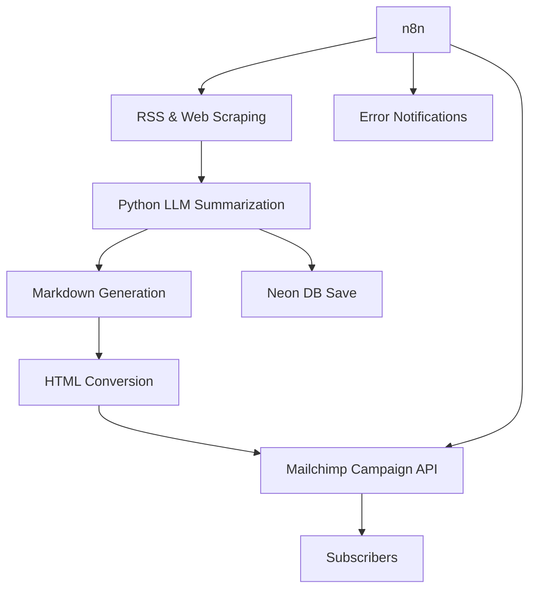

# 🗞️ Weekly AI Transcription Digest

**GTM Engineer Intern: 48-Hour Automated Newsletter Challenge**

Welcome to the **Weekly AI Transcription Digest**, a fully automated newsletter system focused on *Speech-to-Text and AI Transcription* news and research. This project was built as part of a 48-hour challenge to demonstrate a production-grade, scalable, and automated newsletter platform.

---

## 📌 Project Overview

- **Topic**: Speech-to-Text & AI Transcription  
- **Automated**: End-to-end content generation, curation, and email delivery  
- **Sources**: RSS feeds, web scraping, arXiv, Google News, Product Hunt  
- **LLM Summarization**: GPT-based summarization of stories  
- **Distribution**: Mailchimp  
- **Automation**: n8n for scheduling and monitoring  
- **Database**: Neon (PostgreSQL-compatible)  

---

## 🚀 Features

✅ Automated multi-source content collection  
✅ Summarization and curation using LLMs  
✅ Markdown to HTML conversion for professional formatting  
✅ Mailchimp integration to send campaigns to subscribers  
✅ n8n workflow to trigger newsletters on a schedule  
✅ Error-handling notifications via email  
✅ Subscriber signup page hosted on Mailchimp  
✅ Clean, documented, and modular codebase  
✅ Designed for 1000+ subscribers scalability  

---

## 🗂️ Tech Stack

- **Backend**: Python (Flask)  
- **Automation**: n8n  
- **Web Scraping**: Playwright, RSS  
- **LLM**: OpenAI GPT  
- **Database**: Neon (PostgreSQL)  
- **Email**: Mailchimp  
- **Deployment**: Local (with ngrok for webhook testing)  
- **Version Control**: GitHub  

---

## 🏗️ Architecture

