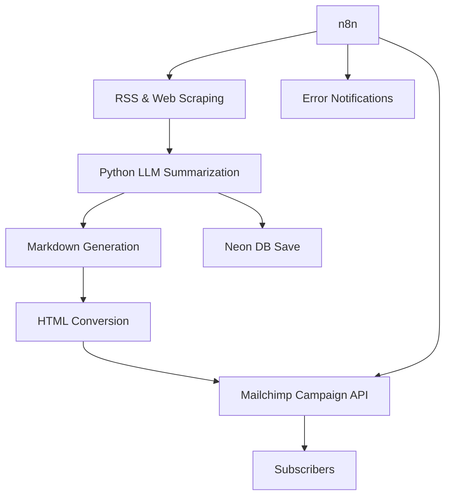

# 🗞️ Weekly AI Transcription Digest

**GTM Engineer Intern: 48-Hour Automated Newsletter Challenge**

Welcome to the **Weekly AI Transcription Digest**, a fully automated newsletter system focused on *Speech-to-Text and AI Transcription* news and research. This project was built as part of a 48-hour challenge to demonstrate a production-grade, scalable, and automated newsletter platform.

---

## 📌 Project Overview

- **Topic**: Speech-to-Text & AI Transcription  
- **Automated**: End-to-end content generation, curation, and email delivery  
- **Sources**: RSS feeds, web scraping, arXiv, Google News, Product Hunt  
- **LLM Summarization**: GPT-based summarization of stories  
- **Distribution**: Mailchimp  
- **Automation**: n8n for scheduling and monitoring  
- **Database**: Neon (PostgreSQL-compatible)  

---

## 🚀 Features

✅ Automated multi-source content collection  
✅ Summarization and curation using LLMs  
✅ Markdown to HTML conversion for professional formatting  
✅ Mailchimp integration to send campaigns to subscribers  
✅ n8n workflow to trigger newsletters on a schedule  
✅ Error-handling notifications via email  
✅ Subscriber signup page hosted on Mailchimp  
✅ Clean, documented, and modular codebase  
✅ Designed for 1000+ subscribers scalability  

---

## 🗂️ Tech Stack

- **Backend**: Python (Flask)  
- **Automation**: n8n  
- **Web Scraping**: Playwright, RSS  
- **LLM**: OpenAI GPT  
- **Database**: Neon (PostgreSQL)  
- **Email**: Mailchimp  
- **Deployment**: Local (with ngrok for webhook testing)  
- **Version Control**: GitHub  

---

## 🏗️ Architecture


---
## ⚙️ Setup & Running Locally

### 1️⃣ Clone the repository

```bash
git clone https://github.com/your-username/weekly-ai-transcription-digest.git
cd weekly-ai-transcription-digest
```
### 2️⃣ Install dependencies
```bash
python -m venv venv
source venv/bin/activate
pip install -r requirements.txt
```
### 3️⃣ Set environment variables

Create a `.env` file in the root directory with the following:

```bash
OPENAI_API_KEY=your_openai_api_key
MAILCHIMP_API_KEY=your_mailchimp_api_key
MAILCHIMP_SERVER_PREFIX=usX
MAILCHIMP_LIST_ID=your_list_id
NEON_DB_URL=your_neon_database_connection_url
```
### 4️⃣ Run the flask server
```bash
python server.py
```
### 5️⃣ Expose Localhost with ngrok

Since n8n on the cloud cannot access your localhost directly, you need to tunnel:

```bash
ngrok http 5000
```
Copy the https:// URL generated by ngrok.

Use this ngrok URL in your n8n HTTP Request node to call the /generate-newsletter endpoint.

## 6️⃣ Configure n8n Workflow
✅ Add a Cron node to trigger the workflow (e.g., every Monday 9AM)
✅ Add an HTTP Request node pointing to your ngrok URL (POST request)
✅ Add an Error Trigger node connected to an Email node for error reporting
✅ Connect the nodes in this sequence:
```bash
Cron ➡️ HTTP Request ➡️ Error Trigger ➡️ Email
```
✅ Save and activate your n8n workflow.
-At this point, you should have a fully automated pipeline:

-Scheduled newsletter generation

-Summarization + content curation

-Database save + Mailchimp delivery

-Monitoring + error alerts


