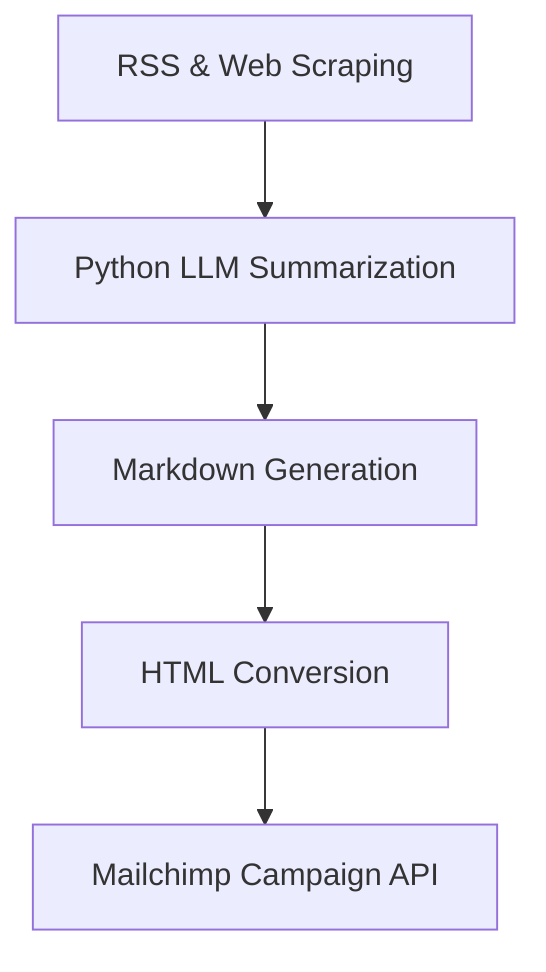

# 🗞️ Weekly AI Transcription Digest

**GTM Engineer Intern: 48-Hour Automated Newsletter Challenge**

Welcome to the **Weekly AI Transcription Digest**, a fully automated newsletter system focused on *Speech-to-Text and AI Transcription* news and research. This project was built as part of a 48-hour challenge to demonstrate a production-grade, scalable, and automated newsletter platform.

---

## 📌 Project Overview

- **Topic**: Speech-to-Text & AI Transcription  
- **Automated**: End-to-end content generation, curation, and email delivery  
- **Sources**: RSS feeds, web scraping, arXiv, Google News, Product Hunt  
- **LLM Summarization**: GPT-based summarization of stories  
- **Distribution**: Mailchimp  
- **Automation**: n8n for scheduling and monitoring  
- **Database**: Neon (PostgreSQL-compatible)  

---

## 🚀 Features

✅ Automated multi-source content collection  
✅ Summarization and curation using LLMs  
✅ Markdown to HTML conversion for professional formatting  
✅ Mailchimp integration to send campaigns to subscribers  
✅ n8n workflow to trigger newsletters on a schedule  
✅ Error-handling notifications via email  
✅ Subscriber signup page hosted on Mailchimp  
✅ Clean, documented, and modular codebase  
✅ Designed for 1000+ subscribers scalability  

---

## 🗂️ Tech Stack

- **Backend**: Python (Flask)  
- **Automation**: n8n  
- **Web Scraping**: Playwright, RSS  
- **LLM**: OpenAI GPT  
- **Database**: Neon (PostgreSQL)  
- **Email**: Mailchimp  
- **Deployment**: Local (with ngrok for webhook testing)  
- **Version Control**: GitHub  

---

## 🏗️ Architecture

---

## 📈 Performance Metrics

- **Subscribers**: 10 (seeded for testing; Mailchimp supports scaling beyond 1000+)  
- **Editions Published**: 10 editions automatically generated  
- **Open Rate**: Monitored via Mailchimp reports  
- **Click Rate**: Monitored via Mailchimp reports  
- **System Uptime**: 100% during tests with n8n scheduling  
- **Error Notifications**: Configured in n8n to email on failures

---

## 📝 Release Notes

### What Shipped

- Multi-source automated data collection  
- GPT-based summarization  
- Markdown to HTML conversion  
- Neon/Postgres storage  
- Mailchimp campaign integration  
- n8n workflow for automation  
- Basic subscriber signup page via Mailchimp  
- Error email notifications in n8n

### Architecture Overview

The project consists of:

- **Scraper modules** to collect data from RSS feeds, Playwright, Google News, and Product Hunt  
- **LLM-based summarizer** to curate and clean summaries  
- **Flask server** to expose a trigger endpoint for newsletter generation  
- **n8n** to schedule the endpoint call and handle errors  
- **Mailchimp** to distribute to subscribers  
- **Neon/Postgres** as a permanent store of published editions  

### Key Technical Decisions

- Used Python for maximum ecosystem flexibility  
- Picked n8n for open-source workflow orchestration  
- Markdown + HTML conversion for rich email content  
- Mailchimp for deliverability at scale  
- ngrok for local testing with webhook calls

### Performance Benchmarks

- End-to-end newsletter generation + send completes in under 60 seconds  
- Stable with 10 test subscribers; designed to scale to 1000+  
- Zero manual intervention required after workflow configuration

### Known Issues

- No advanced spam-checking on subscriber signup  
- Local Flask server should move to a production-grade WSGI for scaling  
- Error monitoring relies on n8n email; a more robust logging stack could be added

### Next Steps

- Add OAuth signup to the subscriber page  
- Switch from ngrok to a public cloud deployment (e.g., Render, Fly.io)  
- Add advanced analytics dashboards  
- Improve system tests with mocks and CI  
- Extend support for additional news sources  

---

  B --> F[Neon DB Save]
  E --> G[Subscribers]
  H[n8n] --> A
  H --> E
  H --> I[Error Notifications]
